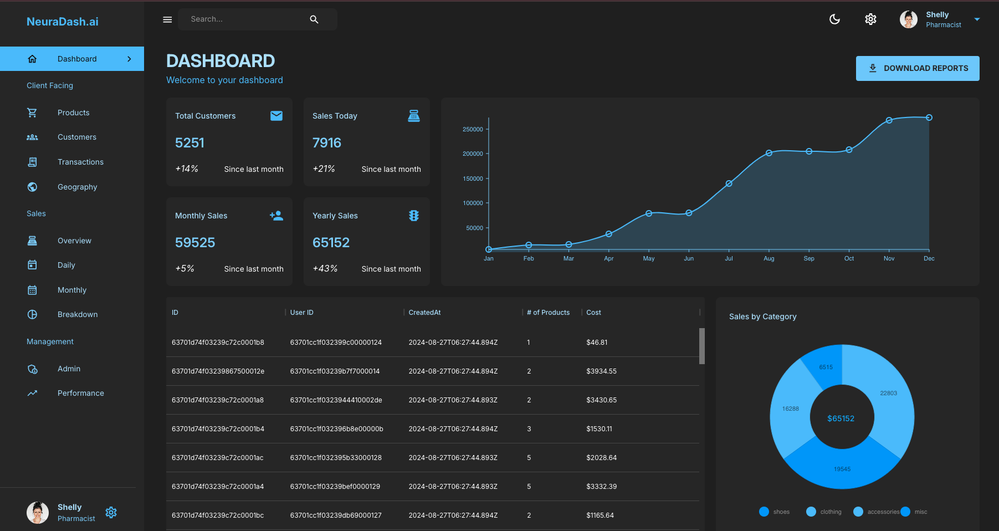

# 📊 MERN Stack Admin Dashboard

A powerful and intuitive admin dashboard built with the MERN (MongoDB, Express.js, React.js, Node.js) stack.

# [Demo](https://admin-frontend-kmh7.onrender.com) 🚀
> [!NOTE]
> Since the demo is hosted on a free tier instance which shuts down after 15 minutes if not being used, it may take a while to get up and running when you open the demo.

<!--  -->
<p align="center">
    
</p>

## 🌟 Features

- 📈 Real-time data visualization
- 👥 User management
- 🛒 Product inventory tracking
- 💹 Sales analytics
- 🗺️ Geographic data representation
- 🌓 Dark/Light mode toggle

## 🛠️ Tech Stack

- **Frontend**: React.js with Material-UI
- **Backend**: Node.js with Express.js
- **Database**: MongoDB
- **State Management**: Redux Toolkit
- **Charts**: Nivo Charts
- **Deployment**: Render

## 🌐 API Endpoints

- `/api/users`: User management
- `/api/products`: Product inventory
- `/api/sales`: Sales data
- `/api/analytics`: Analytics data

## 🐳 Docker Support

This project includes Docker support for easy deployment and development. To use Docker:

1. Ensure Docker and Docker Compose are installed on your machine
2. Run `docker-compose up --build` in the root directory

## 🚀 Getting Started

### Prerequisites

- Node.js (v14+)
- MongoDB

### Installation

1. Clone the repo
```
git clone https://github.com/yourusername/your-repo-name.git
```
2. 🐳 Build using Docker  (Recommended)
   1. Building containers:
      To build your container for the first time:
      ```
      export $(cat ./server/.env | xargs) && docker-compose up --build
      ```

      To start your containers without rebuilding:
      ```
      docker-compose up
      ```

      To run the containers in detached mode (in the background):
      ```
      docker-compose up -d
      ```

      To stop the containers:
      ```
      docker-compose down
      ```

2.  📦 Build using npm
   1. Install NPM packages for both frontend and backend
   ```
   cd client && npm install
   cd ../server && npm install
   ```
   2. Create a `.env` file in the server directory and add your MongoDB connection string
   ```
   MONGO_URL=your_mongodb_connection_string
   ```
   3. Start the development servers

   In the server directory
   ```
   npm run dev
   ```
   In the client directory
   ```
   npm run start

## 🤝 Contributing

Contributions are welcome! Please feel free to submit a Pull Request.

## 📜 License

This project is licensed under the MIT License - see the [LICENSE](LICENSE) file for details.

## 🙏 Acknowledgements

- [React.js](https://reactjs.org/)
- [Express.js](https://expressjs.com/)
- [MongoDB](https://www.mongodb.com/)
- [Material-UI](https://material-ui.com/)
- [Nivo Charts](https://nivo.rocks/)


> [!TIP]
> Some additional tips:

1. Viewing logs:
   If your containers are running in detached mode and you want to see the logs:
   ```
   docker-compose logs
   ```
   Or for a specific service:
   ```
   docker-compose logs server
   ```

2. Entering a running container:
   If you need to run commands inside a running container:
   ```
   docker-compose exec server sh
   ```
   This opens a shell in the server container.

3. Restarting a single service:
   If you've made changes to just one part of your application:
   ```
   docker-compose restart server
   ```

4. Checking the status of your containers:
   ```
   docker-compose ps
   ```